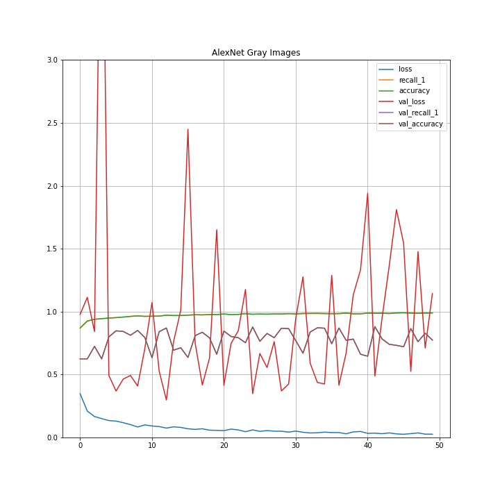
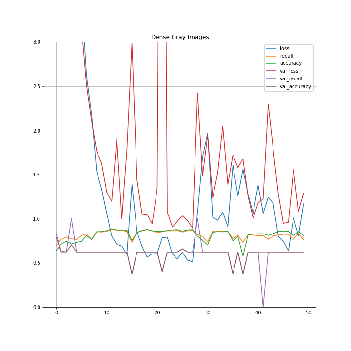
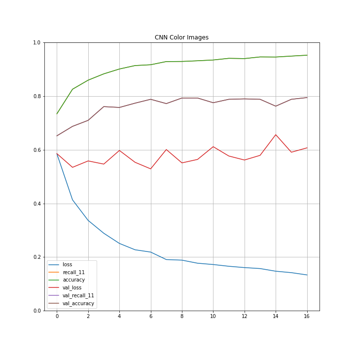
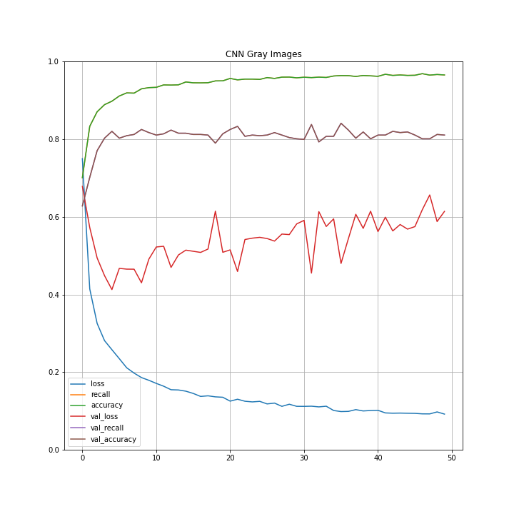
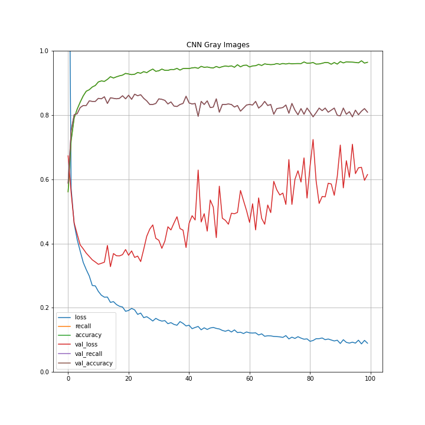
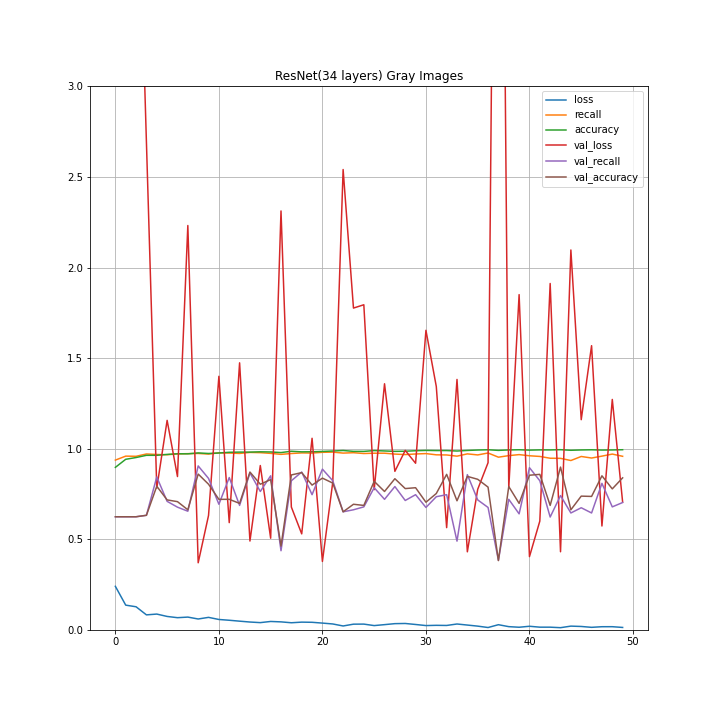
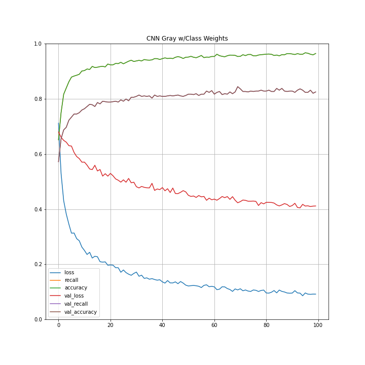

# Predicting Pneumonia

    

## The Idea

I chose X-ray image classification for a few reasons. I have a background in bioethics from my Philosophy studies, so I wanted to do something that had a medical bend, but on a more personal level I am interested in the possibility of computer vision enhancing accuracy of medical diagnoses. My dad had open-heart surgery a few years ago, and he only received this operation because he finally sought a second-opinion on some medical imaging of his chest that revealed a critical feature that his regular heart doctor had missed. Computer vision possibly provides a second-set of eyes for relatively low-cost (once in production phase) in diagnosing conditions in patients.

## The Data

This dataset contains images of normal and pneumonia-riddled lungs (approx. 6000 images) and the goal would be to manipulate the images into a classifier that could predict with some degree of accuracy whether or not a person has pneumonia just by seeing an x-ray of their lungs. My concern is that the dataset is a bit too small, but since each image contains a lot of data perhaps 6000 images is a sufficient number. That data can be found here: https://www.kaggle.com/paultimothymooney/chest-xray-pneumonia

This dataset isn't looking at heart conditions, but I figured it would teach me a lot of similar techniques that could be employed in this area of research.

The notebook contains my exploration of the data and model-running, but for presentation purposes the pdf of slides gives a prettier look at my findings.

## The Results

Here are several graphs representing the results of my various models:

    
    

    
    

    
    

As you can clearly see, none of these models did as well as I'd hoped, but in particular I was disappointed in the Dense architecture with selu activation and lecun normal kernel initialization. The ResNet and AlexNet models also did not work well, although I had to modify both to more simplistic architectures to get them to run on my computer.

And here was my best model, with final results of ~94% recall rate on a set of holdout images:

    

If I were to further this project, I would spin up a powerful EC2 instance on AWS and run some deeper models to see if I could improve recall. I would also like to find a larger and more diverse dataset, and potentially begin to multiclassify into more illnesses.

Thanks for taking the time to look over my project, and if you have any questions, feel free to contact me (kyle.boerstler@studyliberalarts.org)!
